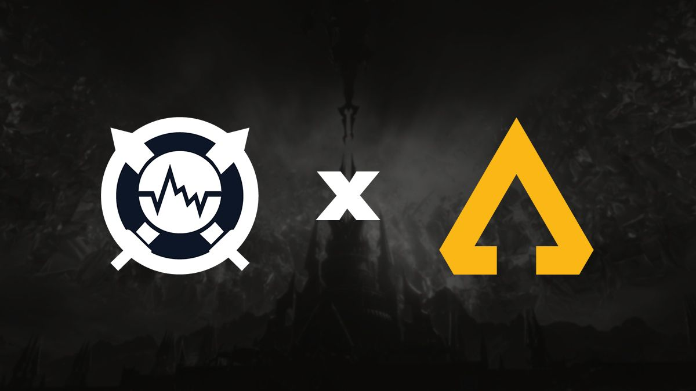

# Version curso
Version actual: 1.2.2

# Cabeceras
# Cabecera H1
## Cabecera H2
### Cabecera H3
#### Cabecera H5
##### Cabecera H5
###### Cabecera H6

# Underlines
Underline 1
------------

Underline 2
===========

# Formatos de Enfásis
- *Formato italica de la primer forma.*
- _Formato italica de la Segunda forma._
- **Formato negrita o bold de la primer forma**
- __Formato negrita o bold de la segunda forma__
- ~~Formato tachado~~

# Listas
1. Esto es un item de lista ordenada
2. Esto es un item de lista ordenada
3. Esto es un item de lista ordenada
- Esto es un item de lista desordenada
- Esto es un item de lista desordenada
- Esto es un item de lista desordenada

# Links
- [Links en markdown](http://www.google.com.co)
- [Link al index](index.html)

# Imagenes 


# Code Snippets
Codigo en Javascript
```Javascript
function $initHighlight(block, cls) {
  try {
    if (cls.search(/\bno\-highlight\b/) != -1)
      return process(block, true, 0x0F) +
             ` class="${cls}"`;
  } catch (e) {
    /* handle exception */
  }
  for (var i = 0 / 2; i < classes.length; i++) {
    if (checkCondition(classes[i]) === undefined)
      console.log('undefined');
  }

  return (
    <div>
      <web-component>{block}</web-component>
    </div>
  )
}

export  $initHighlight;
```

# Tablas
| Nombre | Apellido | Documento |
| ------ | -------- | --------- |
| Brayan | Marin | 123456789 |
| Aprendiendo | Git | ----- |

# Citas
Cualquier cosa
> Esto es una cita

Puedo escribir cualquier cosa
> Otra cita

# Lineas divisorias

Texto que será dividido primera forma

---

Otro texto dividido segunda forma

***

Otro texto dividido tercera forma

___

# Saltos de linea

Primer texto.

Segundo texto.

Tercer texto.
- lista